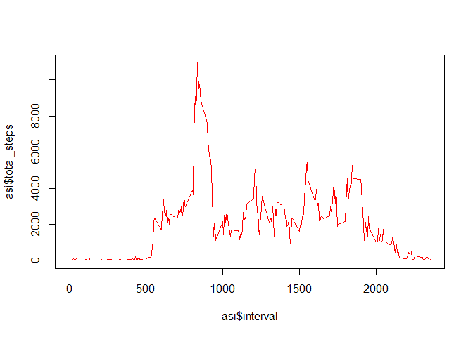
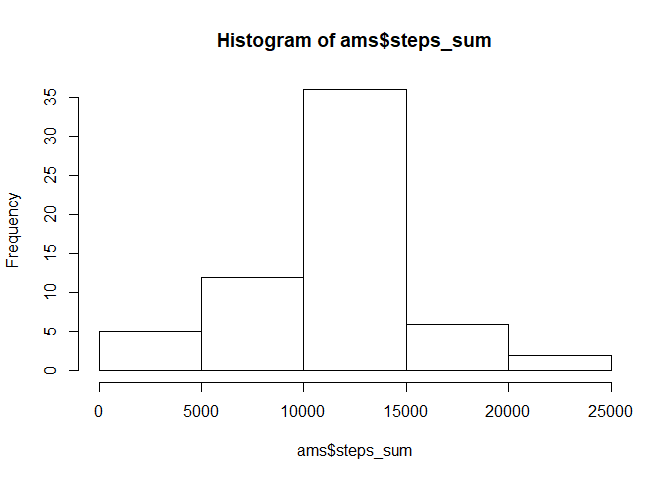
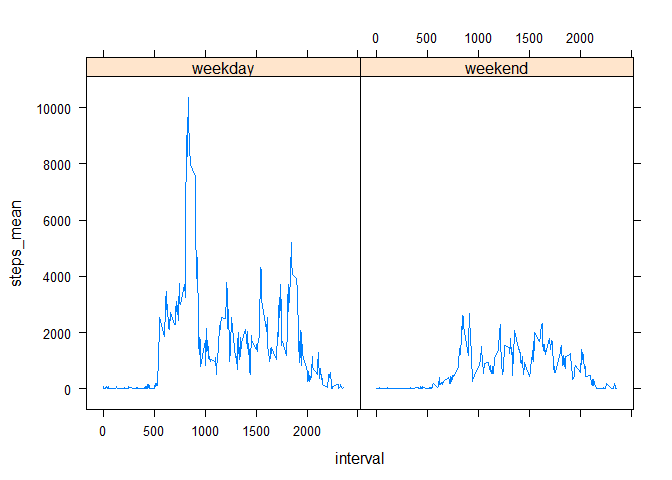

## Loading and preprocessing the data


```r
dir.create("data")
download.file("https://d396qusza40orc.cloudfront.net/repdata%2Fdata%2Factivity.zip", 
              "./data/download.zip")
unzip("./data/download.zip", exdir = "./data")
activity <- read.csv("./data/activity.csv")
library(dplyr)
```

```
## 
## Attaching package: 'dplyr'
```

```
## The following objects are masked from 'package:stats':
## 
##     filter, lag
```

```
## The following objects are masked from 'package:base':
## 
##     intersect, setdiff, setequal, union
```

## What is mean total number of steps taken per day?


```r
activity <- activity %>% group_by(date)
asm <- activity %>% summarise(total_steps = sum(steps))
```

```
## `summarise()` ungrouping output (override with `.groups` argument)
```

```r
mean(asm$total_steps, na.rm = TRUE)
```

```
## [1] 10766.19
```

```r
median(asm$total_steps, na.rm = TRUE)
```

```
## [1] 10765
```

## What is the average daily activity pattern?


```r
activity <- activity %>% group_by(interval)
activity.comp <- complete.cases(activity)
activity.c <- activity[activity.comp,]
asi <- activity.c %>% summarise(total_steps = sum(steps))
```

```
## `summarise()` ungrouping output (override with `.groups` argument)
```

```r
plot(asi$interval, asi$total_steps, type = "l", col = "red")
```

<!-- -->

```r
asi[asi$total_steps == max(asi),]
```

```
## # A tibble: 1 x 2
##   interval total_steps
##      <int>       <int>
## 1      835       10927
```

## Imputing missing values


```r
sum(is.na(activity))
```

```
## [1] 2304
```

```r
activity.m <- activity %>% group_by(interval)
adm <- activity.m %>% summarise(steps_mean = mean(steps, na.rm = TRUE))
```

```
## `summarise()` ungrouping output (override with `.groups` argument)
```

```r
adm$steps_mean <- c(round(adm$steps_mean))
 for (i in 1:nrow(activity.m)){
   if (isTRUE(is.na(activity.m[i,1]))) {
     activity.m[i,1] <- c(adm[adm$interval == activity.m$interval[i],2])
   }
 }

activity.m <- activity.m %>% group_by(date)
ams <- activity.m %>% summarise(steps_sum = sum(steps))
```

```
## `summarise()` ungrouping output (override with `.groups` argument)
```

```r
mean(ams$steps_sum)
```

```
## [1] 10765.64
```

```r
median(ams$steps_sum)
```

```
## [1] 10762
```

```r
hist(ams$steps_sum)
```

<!-- -->

The impact of removing NA's from the orginal dataset was a decrease in both mean and median values when compared to the dataset where NA's were replaced with rounded mean values.


## Are there differences in activity patterns between weekdays and weekends?


```r
library(lubridate)
```

```
## 
## Attaching package: 'lubridate'
```

```
## The following objects are masked from 'package:base':
## 
##     date, intersect, setdiff, union
```

```r
activity.m <- bind_cols(activity.m,
                        as.character(c(rep(NA,nrow(activity.m)))))
```

```
## New names:
## * NA -> ...4
```

```r
names(activity.m)[4] <- "day_type"
activity.m$date <- ymd(activity.m$date)
wdv <- unique(weekdays(activity.m$date))[1:5] 
for (i in 1:nrow(activity.m)){
   if (weekdays(activity.m[[i,"date"]]) %in% wdv) {
      activity.m[[i,"day_type"]] <- c("weekday")
   }else{activity.m[[i,"day_type"]] <- c("weekend")}
}
activity.m$day_type <- as.factor(activity.m$day_type)
```


```r
library(lattice)
activity.m <- activity.m %>% group_by(interval,day_type)
ams <- activity.m %>% summarise(steps_mean = sum(steps))
```

```
## `summarise()` regrouping output by 'interval' (override with `.groups` argument)
```

```r
xyplot(steps_mean ~ interval | day_type, data = ams, type = "l")
```

<!-- -->
